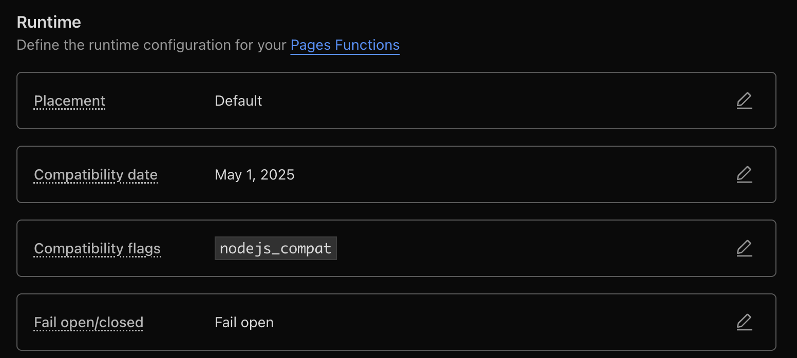

import Note from '../../components/Note.astro'

## **Introduction**

Hello folks I am back with another blog, this time we are going to talk about OG image generation with Astro.

I have been using Astro for my personal Portfolio website since atleast a year now. I was working on SEO for my website and faced some major issues while trying to generate OG images for my blogs.

When searching for solutions, I noticed almost every tutorial used vercel-og for image generation. That's fine if you're on Vercel, but it creates an annoying vendor lock-in situation. I wanted something more flexible, so I put together this guide to help fellow devs avoid the same headaches I went through when deploying your website on **cloudflare**.


## **What are OG Images**

OG images are the images which are generated when we share our posts across on social media channels, like X, instagram, facebook. discord. 
(attach image for eg)

There is research which shows that OG images increase clickthrough rates 

- According to [Twitter's Engineering Insights](https://blog.twitter.com/engineering/en_us/topics/insights/2019/engineeringpublicconversation), tweets with images receive 150% more retweets and 18% more click-throughs.
  
- [BuzzSumo's analysis](https://buzzsumo.com/blog/how-to-massively-boost-your-blog-traffic-with-these-5-awesome-image-stats/) of over 1 million articles showed that content with images gets 2.3x more engagement.


## **How to make this work**

For readers with less time to spare, lets just give you guys a solution first.


### **Do this before you start**

- install this package
```javascript
// https://www.npmjs.com/package/@beroburny/workers-og
pnpm add workers-og
```
- keep your font files in the src directory

this package will be used for image generation, for your OG images. 
PNG format is the most adhered to in terms of images supported by various social media platforms hence this was the best choice.

### **astro.config.js**

```javascript

import cloudflare from "@astrojs/cloudflare";
import fs from 'node:fs'
import path from 'node:path'


export default defineConfig({

  // Vite configuration
  vite: {
    plugins: [rawFonts(['.ttf'])],
    assetsInclude: ['**/*.wasm'], // Treat WASM files as assets (but not TTF files)
    ssr: {
      external: ["buffer", "path", "fs"].map((i) => `node:${i}`),
    },
    // Ensure TTF files are not treated as assets
    assetsExclude: ['**/*.ttf'],
  },
   // Deployment adapter
  adapter: cloudflare(),   

})

function rawFonts(extensions) {
  return {
    name: 'vite-plugin-raw-fonts',
    enforce: 'pre', // Run before other plugins
    resolveId(id, importer) {
      if (extensions.some(ext => id.includes(ext))) {
        // Resolve relative paths properly
        if (id.startsWith('.')) {
          const resolvedPath = path.resolve(path.dirname(importer), id);
          return resolvedPath;
        }
        return id;
      }
    },
    load(id) {
      if (extensions.some(ext => id.includes(ext))) {
        try {
          const buffer = fs.readFileSync(id);
          // Return as a simple Uint8Array that can be used directly
          return `export default new Uint8Array([${Array.from(buffer).join(',')}]);`;
        } catch (error) {
          console.error('Error loading font:', error.message);
          throw error;
        }
      }
    }
  };
}

```

since we are using nodeJs modules and cloudflare workers do not support nodeJs modules by default, we need to enable a flag in the project for nodeJs compatibility
There are 2 ways you can achieve this.

- add a flag for nodeJs compatibility to your local file which will be parsed at build time by the cloudflare enviroment 
```toml
// https://developers.cloudflare.com/workers/runtime-apis/nodejs/#enable-nodejs-with-workers 
compatibility_date = "2024-09-23"
compatibility_flags = ["nodejs_compat"]

```
- If the above guide fails to work, go to your Cloudflare project > Settings > Functions > Compatibility flags and add the flag (as shown below).



### **Image generation**

For this step we need to create a endpoint. More about this [astro endpoints docs](https://docs.astro.build/en/guides/endpoints/).

create a page in the pages directory, for eg, I created a page at `pages/blogs/[slug]/og.png.ts`

```typescript
import { getEntry, type CollectionEntry } from "astro:content";
import { ImageResponse } from "workers-og";
// Import fonts using the rawFonts plugin - these will be converted to buffers
import InterBoldData from "../../../assets/fonts/Inter-Bold.ttf";
import InterRegularData from "../../../assets/fonts/Inter-Regular.ttf";

interface Props {
  params: { slug: string };
  props: { post: CollectionEntry<"blogs"> };
}

export async function GET({ params }: Props) {
  // Get the slug from the incoming server request
  const { slug } = params;

  if (!slug) {
    return new Response("Slug parameter is required", { status: 400 });
  }

  // Query for the entry directly using the request slug
  const post = await getEntry("blogs", slug);

  // Return 404 if the post doesn't exist
  if (!post) {
    return new Response("Blog post not found", { status: 404 });
  }

  // Font data is now properly loaded as Uint8Array by the rawFonts plugin
  const InterBold = (InterBoldData as any).buffer || InterBoldData;
  const InterRegular = (InterRegularData as any).buffer || InterRegularData;

  const { title } = post.data;

  const html = `
    <div style="
      display: flex;
      width: 1200px;
      height: 600px;
      background: linear-gradient(135deg, #160f29 0%, #1a1325 100%);
      padding: 60px;
      box-sizing: border-box;
      align-items: center;
      justify-content: center;
      font-family: 'Inter', -apple-system, BlinkMacSystemFont, 'Segoe UI', sans-serif;
    ">
      <div style="
        display: flex;
        flex-direction: column;
        width: 100%;
        height: 100%;
        justify-content: center;
        align-items: flex-start;
      ">
        <div style="
          display: flex;
          background: rgba(255, 255, 255, 0.05);
          padding: 8px 16px;
          border-radius: 6px;
          margin-bottom: 24px;
          font-size: 16px;
          color: #a855f7;
          font-weight: 500;
        ">
          Blog Post
        </div>
        <div style="
          display: flex;
          font-family: 'Inter', -apple-system, BlinkMacSystemFont, sans-serif;
          font-size: 48px;
          font-weight: 700;
          line-height: 1.1;
          color: #ffffff;
          margin: 0;
          max-width: 100%;
          word-wrap: break-word;
        ">${title}</div>
        <div style="
          display: flex;
          align-items: center;
          margin-top: 40px;
          color: #9ca3af;
          font-size: 18px;
        ">
          <div style="
            display: flex;
            width: 40px;
            height: 40px;
            background: linear-gradient(45deg, #a855f7, #ec4899);
            border-radius: 50%;
            margin-right: 16px;
            align-items: center;
            justify-content: center;
            font-weight: 600;
            color: white;
          ">
            VL
          </div>
          <div style="display: flex;">Vivek Lokhande</div>
        </div>
      </div>
    </div>
  `;

  return new ImageResponse(html, {
    width: 1200,
    height: 600,
    fonts: [
      {
        name: "Inter",
        data: InterBold,
        style: "normal",
        weight: 700,
      },
      {
        name: "Inter",
        data: InterRegular,
        style: "normal",
        weight: 400,
      },
      {
        name: "Inter",
        data: InterRegular,
        style: "normal",
        weight: 500,
      },
    ],
    debug: false, // Set to true if you want to see debug info
  });
}

```

## **Viewing Your Generated OG Images**
You can view your generated OG images in any of these three ways:

### Local Development
Visit your dev server at:
```
http://localhost:4321/blogs/blogName/og.png
```
### After Build
Create a build and access the image at the same path on your local server

### Production
Deploy your website to Cloudflare and access the image at:
```
https://your-domain.com/blogs/blogName/og.png
```

Replace blogName with the actual slug of your blog post to see the specific OG image generated for that content.


## Testing Your Generated OG Images

After deploying your site, you'll want to verify how your OG images appear across different social media platforms. Here's how to test them:

### Social Media Preview Tools

I recommend using [OpenGraph.xyz](https://www.opengraph.xyz/) or [Social Share Preview](https://socialsharepreview.com/) to test how your OG images render on different platforms. These tools let you enter your URL and see previews for:

- Twitter/X
- Facebook
- LinkedIn
- Discord
- Slack

### Important Format Considerations

<Note type="tip" title="Important Information">
While the preview tools may display SVG images correctly, many social media platforms **do not support SVG format** for OG images. Stick with PNG format (which our implementation uses) for maximum compatibility across platforms like Twitter/X and Discord.
</Note>
### Real-World Testing

For the most accurate results, consider posting test links to a private/test account on each platform you want to target. This gives you confidence that your OG images appear correctly in production

## **References & Resources**

- [Dynamic OpenGraph Images in Astro](https://blog.otterlord.dev/posts/dynamic-opengraph/) - A comprehensive guide on implementing dynamic OG images in Astro projects
- [Creating Open Graph Images with Satori](https://rumaan.dev/blog/open-graph-images-using-satori) - Learn how to use Satori for generating beautiful OG images for your content
- [Static OG Images in Astro with Vercel OG](https://www.kozhuhds.com/blog/generating-static-open-graph-og-images-in-astro-using-vercel-og/) - An alternative approach using Vercel's OG image generation tools


## **Useful Libraries**

During my exploration of Astro OG image generation, I found these libraries particularly helpful:

- [astro-seo](https://github.com/jonasmerlin/astro-seo) - A comprehensive SEO integration for Astro to manage meta tags and OG data
  
- [astro-font](https://github.com/rishi-raj-jain/astro-font) - An Astro integration for optimized font loading and management
  
- [satori-html](https://github.com/natemoo-re/satori-html) - A utility to transform HTML to images using Satori, perfect for OG image generation
  
- [resvg-js](https://github.com/thx/resvg-js) - A high-performance SVG renderer and converter