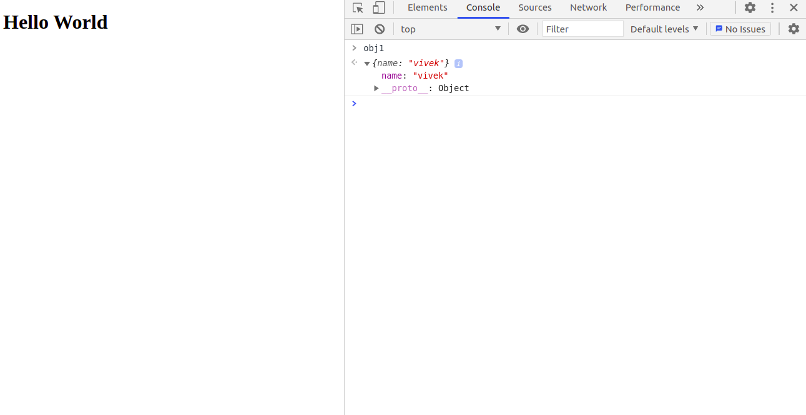
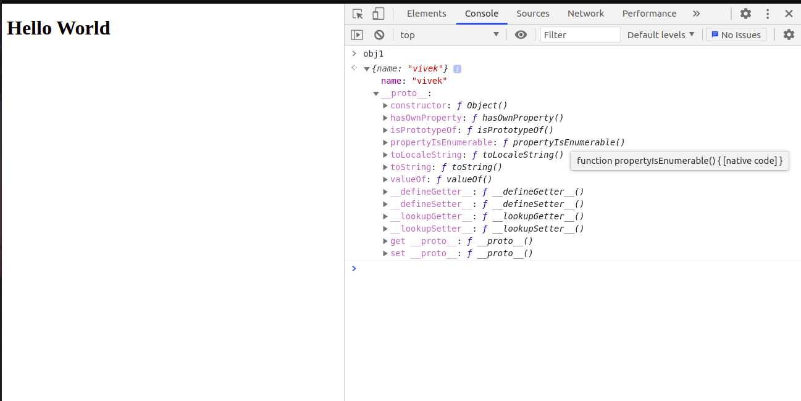
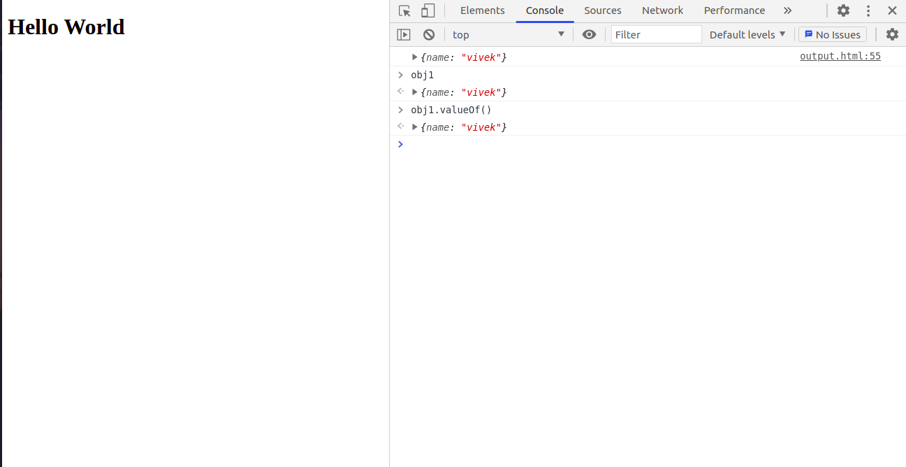
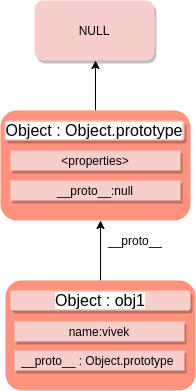
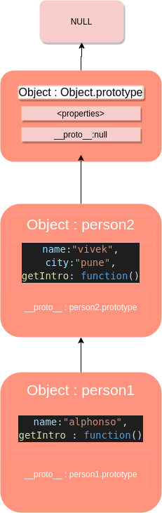
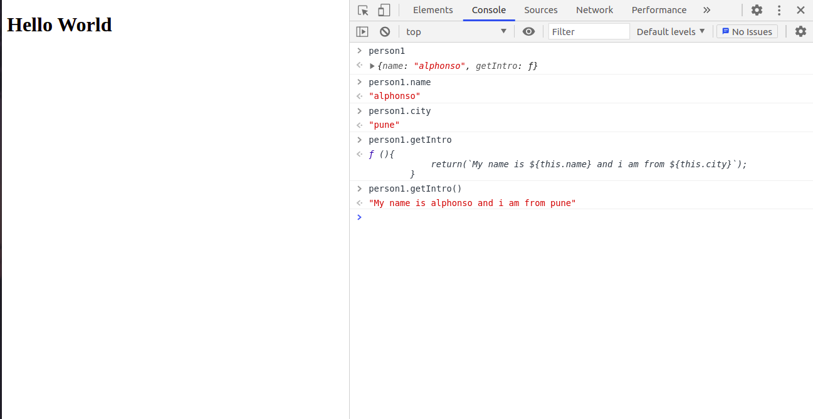

Hello guys, this is the first time I'm writing a blog. I decided to write this blog a day ago but couldn't find any topic. It's just so difficult to choose just one topic when all of them are interconnected to each other. It really becomes difficult to draw a line. Anyway, I've decided to write on prototypes and prototypical Inheritance in JavaScript. Hope I do justice to this topic. Let's start!! But, first time for a meme.


---

**About JavaScript**,

> JavaScript is a high-level, dynamic, and loosely-typed programming language. It is highly object-oriented to the core with its prototype-based model, inspired by  \[Self\](https://en.wikipedia.org/wiki/Self\_(programming\_language)  programming language.

OK the last point is **highly object-oriented to the core with its prototype-based model** let's focus on that

# JavaScript Objects

You must've heard everything in JavaScript is an object. The JavaScript Object is different from what you would call an object in **Java** or **C++**. The javascript object is basically a key-value pair. Let me show you an example.

```javascript
obj1 = {
  name: "vivek" /*here name is the key and vivek is the value*/,
};
```



# JavaScript Prototype's

Now, if we go to the console and print the object you can see that there is a **drop down**. Let's click on that. Once you click on the drop down you will see the object properties.

1. key-value pair
2. \_ _proto_ \_

**What is the proto property and how did it come here? We did not add the property, So how did this happen?**  
Would you believe me if I said that JavaScript added this property to the object **obj1** of ours by itself, and it does the same thing for every different kind of object we declare? Yes it's true, we don't have anything to do with the property and it was added by JavaScript itself. Now if we click the **drop-down** corresponding to the \_ _proto_ \_ property we will see this..



These are all the properties of the object \_ _proto_ \_\_\_\_ . By object i mean the key  
\_ _proto_ \_\_\_\_ has all these listed properties which you can see right now in the corresponding picture.  
We can use these properties on our object **obj1** by using the **" . "** operator. Try this code in your editor

```javascript
obj1 = {
  name: "vivek" /*here name is the key and vivek is the value*/,
};
const obj1Copy = obj1.valueOf();
console.log(obj1Copy);
```

Or you can directly try and access the properties on the **console**.



I hope i am clear about the prototype Object and the part in which you might feel that how can our object access these properties from the prototype ; we refer to a concept called prototypical inheritance in javascript.

# Prototypical Inheritance in JavaScript



The above image will help me as I go about explaining this part called **Prototypical Inheritance in JavaScript**

Let's go stepwise:

1. I declare an object **obj1**.
2. I will try to access its property name by using the following code

```javascript
obj1 = {
  name: "vivek" /*here name is the key and vivek is the value*/,
};
console.log(obj1.name); /*prints vivek*/
```

1. Similarly if I want to check the value of my object I will write this code.

```javascript
obj1 = {
  name: "vivek" /*here name is the key and vivek is the value*/,
};
console.log(obj1.name); /*prints vivek*/
console.log(obj1.valueOf()); /*prints value of obj1*/
```

1. This property **valueOf()** was not declared in the object but was inherited from the **Object. prototype** object .
2. when I asked for the value of the object in the **3rd statement**, the JavaScript execution engine first looked in the **current object's** i.e **obj1** properties and since it didn't find the property in the object it went to find it in **object. prototype**.

---

(Remember **Object. prototype** is simplicity i.e automatically linked to our object **obj1** without us doing anything. It is default JS behaviour)

---

1. This is where it found the property **valueOf()** and we could use it.
2. As simple as that!!


# Example

Now you understand how inheritance works in JS let's take one more example to make you more familiar with this concept.

```javascript
var person1 = {
  name: "alphonso",
  getIntro: function () {
    console.log(`My name is ${name} and i am from ${city}`);
  },
};

var person2 = {
  name: "vivek",
  city: "pune",
  getIntro: function () {
    console.log(`My name is ${name} and i am from ${city}`);
  },
};

person1.__proto__ = person2;
```

What we have done here is that assigned the property \_ _proto_ \_ of **person1** to **person2** and now the chain would look somewhat like this...



Now, lets try to access the properties of **person1**,

```javascript
var person1 = {
  name: "alphonso",
  getIntro: function () {
    return `My name is ${this.name} and i am from ${this.city}`;
  },
};

var person2 = {
  name: "vivek",
  city: "pune",
  getIntro: function () {
    return `My name is ${this.name} and i am from ${this.city}`;
  },
};

person1.__proto__ = person2;

console.log(person1.name); /*alphonso*/
console.log(person1.city); /*pune*/
console.log(person1.getIntro()); /*My name is alphonso and i am from pune*/
```

OR, you can also print it on the **console**..



Lets see what happened here:

1. first I declared an object **person1** with properties name and **getIntro()**
2. then I declared an object **person2** with properties **name,** **city** and **getIntro()**
3. I linked the **proto** property of person1 with object **person2**.
4. That's why when i print the city of **person1** JavaScript Exec Engine first looks in \*\*person1 \*\* and since it is not able to find it inside **person1** , it goes to person1.prototype where it finds **person2 and as a consequence finds the property person2.city**


