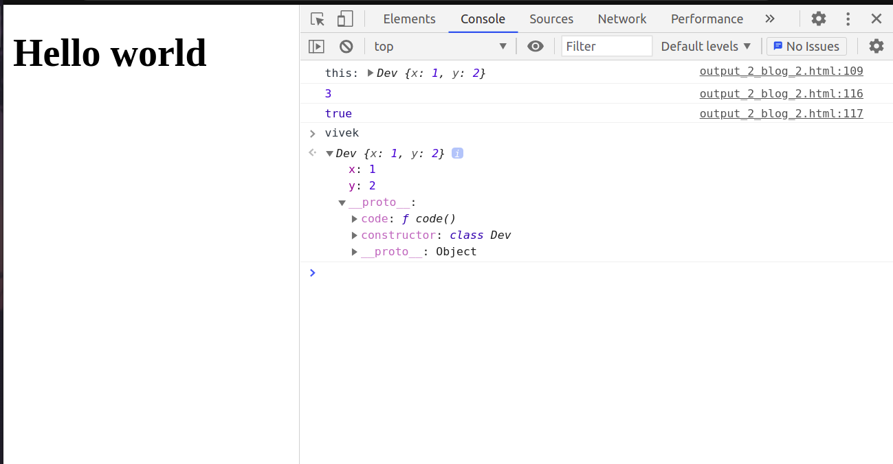
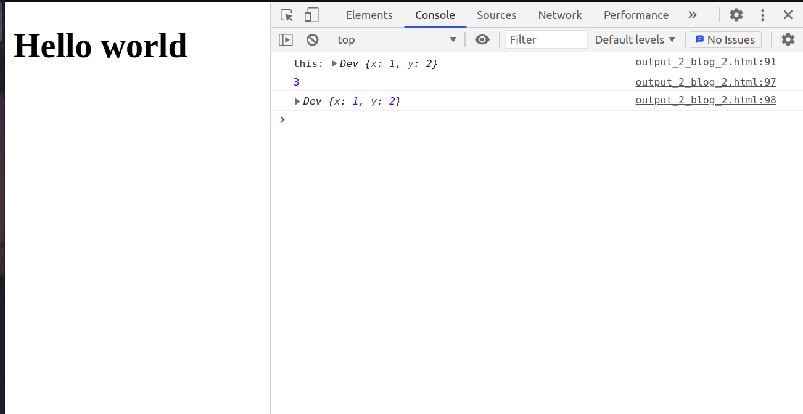
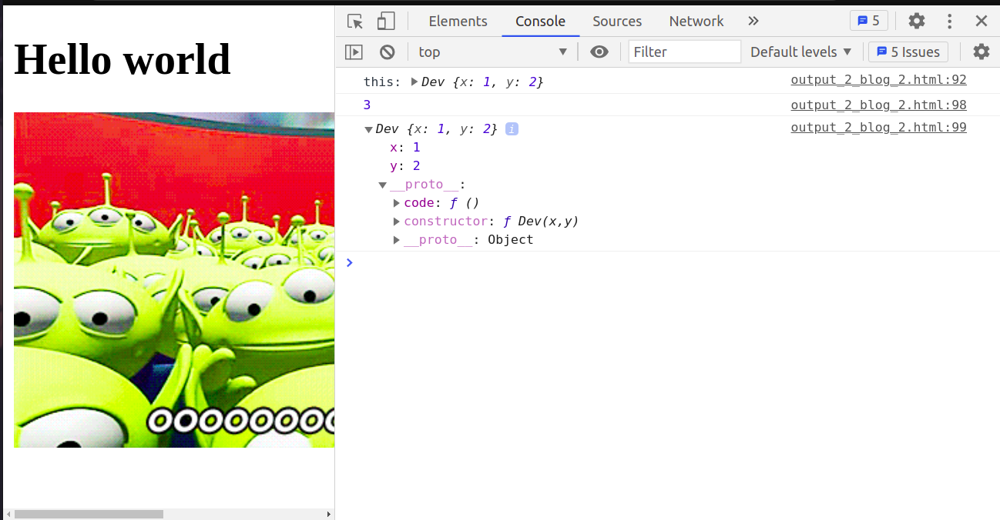
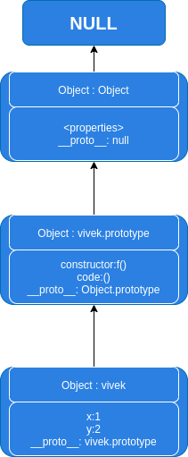

**TL;DR** ECMAScript6 introduced _classes_ as a syntactical sugar for creating prototype constructors. It is said to improve code readability. This blog focuses on how everything worked before classes .

> JavaScript is a high-level, dynamic, and loosely-typed programming language. It is highly object-oriented to the core with its prototype-based model, inspired by Self programming language.

## Points to remember

- **ECMAScript6** had introduced class keyword as syntactic sugar on top of the (existing) prototype-based programming model, and there hasn't happened any change to this model.


### Class Terminology

- class : A type of a blueprint used for making objects.
- object : Acts as an instance of a class. Multiple instances of a class can be created.
- method : The functions which lie inside of classes are called as methods of a class.
- constructor : A special function which is called implicitly once we create an object of a class.

### ES6 class component and its pre ES6 equivalent

```javascript
class Dev {
  constructor(x, y) {
    this.x = x;
    this.y = y;
  }

  code() {
    console.log("this:", this);
    return this.x + this.y;
  }
}
var vivek = new Dev(1, 2); /*create instance of class Dev*/
var sum = vivek.code(); /*call method sum on the object vivek*/
console.log(sum); /*prints 3*/
console.log(vivek instanceof Dev); /*returns true*/
```

\*Let me also show the **console** \*



Let me explain the code here in stepwise manner..

1. first I declared a class.
2. then I instantiate the class with object name vivek passing the constructor 2 integers.
3. on opening the console, we can see all the outputs

But, let's examine the object `vivek` in more detail. When we expand it in the console, we might see something like this:

```javascript
vivek: {
  x: 1,
  y: 2,
  [[Prototype]]: Object
}
```

Notice that the object has three properties:

- The values `x` and `y` we passed to the constructor
- A special `[[Prototype]]` property (displayed as `__proto__` in some browsers)

When we expand the `[[Prototype]]` property, we find:

```javascript
[[Prototype]]: {
  code: ƒ(),
  constructor: class Dev,
  [[Prototype]]: Object
}
```

This reveals something interesting: the `code()` method we defined in our class isn't stored directly on the object itself, but rather on its prototype! This is a key insight into how JavaScript classes actually work under the hood.

---

```javascript
function Dev(x, y) {
  this.x = x;
  this.y = y;
}

Dev.prototype.code = function () {
  /*code is a function which is added to prototype of Dev function*/
  console.log("this:", this);
  return this.x + this.y;
};

var vivek = new Dev(1, 2); /*instantiate a new object*/
var sum = vivek.code(); /*call the method on the instance*/
console.log(sum); /*prints the return value*/
console.log(vivek); /*prints the vivek object*/
```

\*lets look at the \*\*console \*_as well_



Let's click on the **drop down** and now see the **MAGIC!!**



First let's just go over the **code**..

1. declare a function. Here it can also be called a constructor function because it instantiates an object.
2. next create a function called \*\*code \*\* and assign it to **Dev.prototype**
3. now, instantiate the object called **vivek** and call the method inside it.


The console output for this function constructor approach is remarkably similar to the class example. Let's break down the `vivek` object created using the function constructor:

When we inspect the `vivek` object, we see its own properties (`x` and `y`) and its internal `[[Prototype]]` link:

## Inspecting the Function Constructor Object

The object structure here mirrors what we saw with the **class-based** object:

When examining the object in your browser's console, you'll notice:

1. **Instance properties** - Direct properties like `x`, `y` appear at the top level
2. **Prototype chain** - Expanding the [[Prototype]] dropdown reveals:
   - The `code()` method we added via `Developer.prototype.code`
   - The constructor reference pointing back to our `Developer` function

This structure confirms that function constructors and ES6 classes create identical prototype chains behind the scenes.

> Doesn't it totally resemble the class? The answer is quite clear and a huge **YES!!**

The function constructor pattern in pre-ES6 JavaScript is equivalent to class declarations in ES6. We can see that:

- Instance variables are declared on `this` in the Function object
- Methods are defined on the Function.prototype object
- A reference is created automatically between Function and Function.prototype objects through the prototype chain during instantiation with the `new` keyword

> Doesn't it totally resemble the class ? The answer is quite clear and a huge **YESS!!**

The code snippet above shows declaration of Function Constructor in pre-ES6 (equivalent to class declaration in ES6). We can see that instance variables are declared on this in Function object, and the methods are defined on Function.prototype object. There will be a reference created automatically between Function and Function.prototype objects through \_ _proto_ \_\_\_\_\_\_\_\_ property on Function object during instantiation using new keyword. The methods on Function.prototype will be called on the instance object.

### Prototypical chain

here's how the prototypical chain for syntax's would look like



Essentially, we get the same prototype chain on class and Function Constructor declarations.


**_Result_**

1. properties defined on constructor in ES6 can be mapped to properties defined on Function object in ES5.
2. methods defined on classes in ES6 can be mapped to properties (methods) declared on Function.prototype object in ES5.
3. class in ES6 can be thought of as an instruction to JavaScript compiler to automatically populate the prototype object


With this written we officially come to the end of the b**log.** Hope you enjoyed reading it as much as i enjoyed writing it.I hope i have made these concepts clear to you . If you have any doubt's or want to criticise any point you can comment below.
