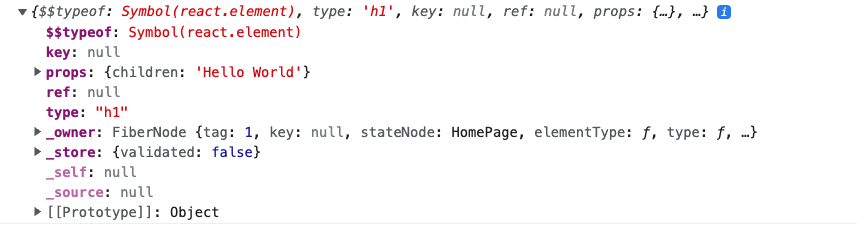
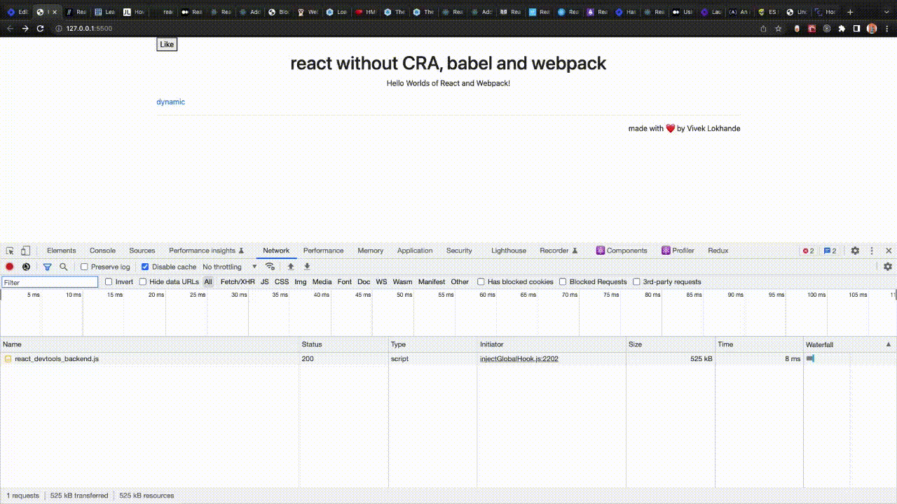

Recently while working on a client project, we faced the problem of having to analyze and reduce the bundle size, improve SEO metrics like FCP and LCP, and improve the loading time for the build. The project used Webpacks for configuring `npm` packages, Babel for `jsx` and converting es6 javascript to browser-compatible JavaScript. During the run of the project, I was very surprised when I saw the control a developer can have while building a website as it was my first encounter with Webpack and I was blown away by the efficiency with which it happens.

  

# About Webpack

**Webpack** is a static module bundler which processes your app by starting from the list of modules defined in its configuration file (`webpack.config.js`). Starting from these entry points, Webpack recursively builds a dependency graph that includes every module your application needs and then proceeds to bundling all of those modules into a small number of bundles - often, only one( `bundle[hash].js`) - to be loaded by the browser in your `index.html` file.

But, let us not sway away from the topic! In this article, we will see all about Webpack and in the second instalment of this blog, we will proceed to go in-depth into the topic to explore all the functionalities of this technology.

### Prerequisites:

To follow the instructions in this article, you will require:

- Beginner to intermediate knowledge of React
- Basic knowledge of hooks and class-based components
- es-modules [import](https://flaviocopes.com/es-modules/) and [exports](https://flaviocopes.com/es-modules/)

# The Coding:

Now that we have a slight hint of what we're going to learn, let's start with the basic building block of our application:

## `React.createElement`

Let's first go over how we can render `jsx` on the browser. I'm sure you know how to do this, but let us revise this topic. Here are some observations:

1. In this step, the `jsx` that we write is converted to `React.createElement` objects.
2. These objects are a part of the virtual dom (VDOM).
3. The virtual dom (VDOM) is always in sync with the actual DOM.
4. React uses a [diffing](https://reactjs.org/docs/reconciliation.html) algorithm to update the real DOM&gt;

`React.createElement` will be our building block of choice here since we want to avoid `jsx` elements(We also have to avoid Babel since it compiees `jsx` to JavaScript objects)

Here is the diagramatic representation for the `React.createElement`:


Enter the following code snippet into your console:

```javascript
//eg.
React.createElement("h1", {}, "Hello World");
```

Logging the above code on the console would give us the following result:



1. The first argument here is the type of the element eg. `div`, `h1`, etc.
2. The second would be the props or attributes, eg. `classname`.
3. The third is the children, eg. `text` or any other `element`.

## `codesandbox`:

Here is the [link](https://codesandbox.io/s/react-without-cra-uyw93j?file=/functionalComp/homepage.js) for you to experiment with this tech stack.

> Note: We are going to use both class-based and functional components since I am assuming that you might be comfortable with either or both of them.

## Setting up `index.html`

You can use any code editor of your choice, I would recommend `vs-code`. Enter the following snippet into your console:

```javascript
<html>
  <head>
    <title>React Hello World</title>
    <link
      rel="stylesheet"
      href="https://cdn.jsdelivr.net/npm/bootstrap@4.3.1/dist/css/bootstrap.min.css"
      integrity="sha384-ggOyR0iXCbMQv3Xipma34MD+dH/1fQ784/j6cY/iJTQUOhcWr7x9JvoRxT2MZw1T"
      crossorigin="anonymous"
    />
    <script
      src="https://cdn.jsdelivr.net/npm/bootstrap@4.3.1/dist/js/bootstrap.min.js"
      integrity="sha384-JjSmVgyd0p3pXB1rRibZUAYoIIy6OrQ6VrjIEaFf/nJGzIxFDsf4x0xIM+B07jRM"
      crossorigin="anonymous"
    ></script>
    <script
      src="https://unpkg.com/react@18/umd/react.development.js"
      crossorigin
    ></script>
    <script
      src="https://unpkg.com/react-dom@18/umd/react-dom.development.js"
      crossorigin
    ></script>
  </head>
  <style>
    .text {
      text-align: center;
    }
  </style>
  <body>
    <div id="like_button_container"></div>
    <div id="homepage"></div>

    <script type="module" src="./functionalComp/homepage.js"></script>
    <!-- <script type="module" src="./classBasedComp/homepage.js"></script> -->
  </body>
</html>
```

- We are using `react` and `react-dom` libraries for the react development setup and Bootstrap for CSS (You can remove and provide styles in the style tag option).
- As `react` and `react-dom` libraries are required out-of-the-box if we are going to use `react-hooks` or any React class-based components, `react-dom` can be the equivalent for the virtual dom (VDOM).
- Bootstrap is a library that provides styles out-of-the-box. You simply have to use the class names provided by Bootstrap in your elements to apply styles.
- I am using a `CDN` for these dependencies, but we could also initialize the repo using `npm init` and then install these as `npm libraries`(I would you to try my approach).
- We also have a `div` element which we will use to create our root for the React app.
- We will be linking our `homepage.js` to the script tag as it has an attribute of the type given which is assigned as a `module` element.

> It is important that we give the `homepage.js` script tag an attribute of the module since it tells the compiler that the `homepage.js` is an `es-module`. This indicates whether we can import or export JavaScript files as `es-modules` according to our liking, or else it will give us an error message. Read more about `es-modules` [here](https://flaviocopes.com/es-modules/)

# Setting up our homepage

Our homepage that we are going to reference here is a React class-based component. Since I am not using `jsx`, I will instead use `React.createElement` to set up the homepage.

- Use the following snippet to create class-based components:

```javascript
import LikeButton from "./like_button.js";
const e = React.createElement;

class HomePage extends React.Component {
  constructor(props) {
    super(props);
  }

  render() {
    return e(
      "div",
      { className: "col-8 m-auto" },
      "",
      e(LikeButton),
      e("h1", { className: "text" }, "react without CRA, babel and webpack"),
      e(
        "p",
        { className: "text-center" },
        " Hello Worlds of React and Webpack!",
      ),
      e("a", { href: "dynamic.html" }, "dynamic"),
      e("hr", null),
      e("p", { className: "text-right" }, " made with ❤️ by Vivek Lokhande"),
    );
  }
}

const domContainer = document.querySelector("#homepage");
const root = ReactDOM.createRoot(domContainer);
root.render(e(HomePage));
```

- Use the following snippet to create functional components:

```javascript
import LikeButton from "./like_button.js";
const e = React.createElement;
function HomePage() {
  return e(
    "div",
    { className: "col-8 m-auto" },
    "",
    e(LikeButton),
    e("h1", { className: "text" }, "react without CRA, babel and webpack"),
    e("p", { className: "text-center" }, " Hello Worlds of React and Webpack!"),
    e("a", { href: "dynamic.html" }, "dynamic"),
    e("hr", null),
    e("p", { className: "text-right" }, " made with ❤️ by Vivek Lokhande"),
  );
}

const domContainer = document.querySelector("#homepage");
const root = ReactDOM.createRoot(domContainer);
root.render(e(HomePage));
```

At a first glance, you can notice that:

1. We are able to use `es-modules` import/exports since the `homepage.js` file is a module.
2. The given component is stateless.
3. We are nesting our components inside a `div` element.
4. As I mentioned before, we are going to use homepage as our root element.

## Setting up our `likeButton` component

Use the code given below to implement class-based components:

```javascript
const e = React.createElement;

class LikeButton extends React.Component {
  constructor(props) {
    super(props);
    this.state = { liked: false };
  }

  render() {
    if (this.state.liked) {
      return e("p", {}, "You liked this.");
    }

    return e(
      "button",
      { onClick: () => this.setState({ liked: true }) },
      "Like",
    );
  }
}
export default LikeButton;
```

Use the code given below to implement functional components:

```javascript
const e = React.createElement;
function LikeButton() {
  const [liked, setLiked] = React.useState(false);

  if (liked) {
    return e("h5", {}, "You liked this.");
  } else {
    return e("button", { onClick: () => setLiked((prev) => !prev) }, "Like");
  }
}

export default LikeButton;
```

At first glance, you can notice that:

1. The given component has states.
2. We are using the state for conditionally rendering the UI.

## Adding the `dynamic.html` page

Cope-paste the code that is given below for your reference:

```javascript
<!DOCTYPE html>
<html lang="en">
  <head>
    <meta charset="UTF-8" />
    <meta http-equiv="X-UA-Compatible" content="IE=edge" />
    <meta name="viewport" content="width=device-width, initial-scale=1.0" />
    <title>Document</title>
  </head>
  <body>
    dynamic
  </body>
</html>
```

Now let's look at how everything will function when put together. While working, I have opened the `index.html` file on my browser. Here's a picture given below for your reference:



# Additional notes

Use the following code to pass multiple children to `React.createElement`:

```javascript
React.createElement(
  "div",
  { className: "parent__div" },
  React.createElement(
    "h1",
    { className: "text" },
    "react without CRA, babel and webpack",
  ),
  React.createElement(
    "p",
    { className: "text" },
    "Hello Worlds of React and Webpack!",
  ),
);
```

You can pass as many elements as you want. Using this syntax, you can nest elements to your liking.

# Takeaways

- The gif shows that since we do not have a `build.js` file and all files are fetched separately, taking away the scalability factor.
- We can see that as we write more and more code for `jsx`, it keeps on getting cumbersome to the eye.
- This process also goes on to show how far we have come when it comes to developing applications by setting up pipelines for apps with just one command eg. CRA (`create-react-app`)
- As we go on increasing the complexity of the application, we will face bigger problems. For example: I tried to add `react-router` here for navigation, but had to give up on the idea in the end because of the complexity involved.

# Sources

[React.createElement-1](https://learn.co/lessons/react-create-element), [React.createElement-2](https://symfonycasts.com/screencast/reactjs/react-create-element), [esmodules](https://flaviocopes.com/es-modules/), [common-js modules](https://flaviocopes.com/commonjs/), [React without jsx](https://reactjs.org/docs/react-without-jsx.html), [Add React to a website](https://reactjs.org/docs/add-react-to-a-website.html)
