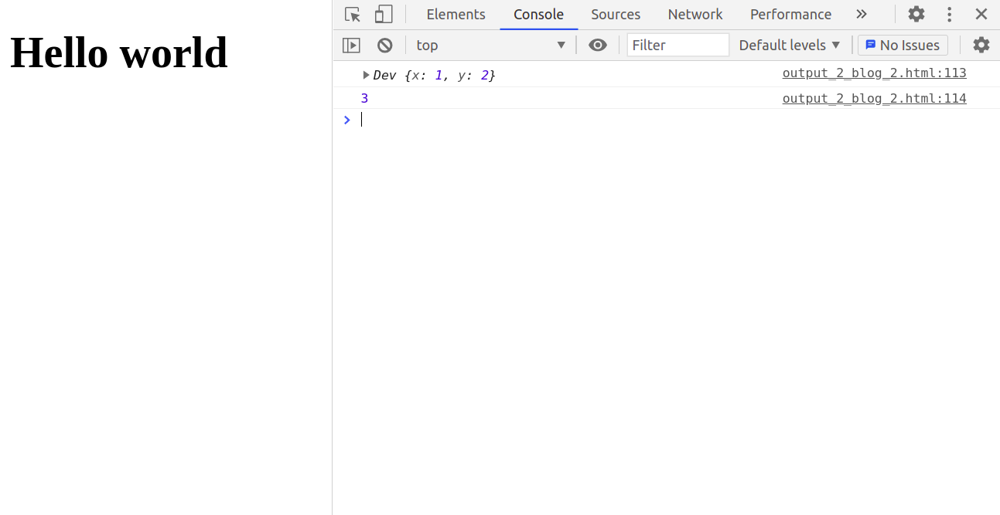
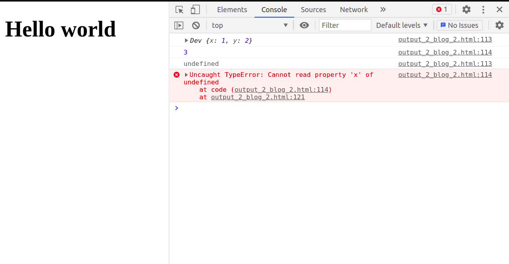
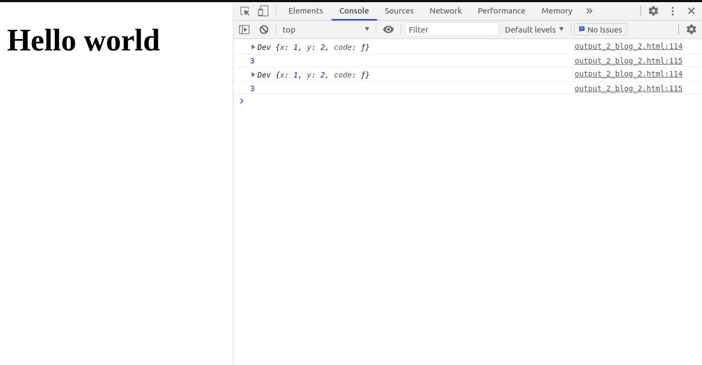

If you have ever written classes in react (now people use hooks) . Before React came up with hooks to make things simpler it had class-based components and very few functional components. Even so, the function-based components were looked down upon because their utility was far less. But now the times have changed. Maybe for the good because everywhere I go, I hear praises for functional components because,

1. they have a simpler syntax
2. they are less verbose
3. easy to understand I might just start writing about functional components, let's stop and change our course..

> **TL: DR** This blog explains the most common problem react developer's face while using class-based components of binding methods to objects. Why does the problem occur and how can it be solved

Even though it may look like a **react** problem that is not the case, It is a javascript problem and here is how u can understand it better.

## this Keyword

What is more important to understand about the **this** keyword is that it very much depends upon the context in which it lies. It is very different to the likes of other **OOP** languages as **JAVA** or **C++**.


```javascript
class Dev {
  constructor(x, y) {
    this.x = x;
    this.y = y;
  }

  code() {
    console.log(this);
    console.log(this.x + this.y);
  }
}
var vivek = new Dev(1, 2); /*create instance of class Dev*/
vivek.code(); /*calling method of the instance*/
```

let me also show the **console**..



Here we can see the output, where first line prints the object `vivek` ; we can recognize is since its shows the value we had passed to the object when we instantiated it. the next line prints the sum of the values we had passed.

Now, lets add couple of lines, to the code..

```javascript
class Dev {
  constructor(x, y) {
    this.x = x;
    this.y = y;
  }

  code() {
    console.log(this);
    console.log(this.x + this.y);
  }
}
var vivek = new Dev(1, 2); /*create instance of class Dev*/
vivek.code(); /*calling method of the instance*/
var call =
  vivek.code; /*assigning the instance's method to another variable, undefined*/
call(); /*TypeError: Cannot read property 'x' of undefined*/
```

let's checkout the output..



The output prints

1. `undefined` on first line.
2. TypeError: Cannot read property 'x' of undefined

**Why does this happen?**  
let's see what we did,

1. First we declare a `var` named `call` and assign it the value `vivek.code`i.e the method inside the instance object.
2. Then we invoke the `call` variable. As i said earlier the `this` keyword works under context, and here we have assigned the function the the variable **call** without any context. Hence , the function acts as a stand-alone function. This is the most confusing part and took me time to understand because i was comparing it to other **OOP** languages.  
   **READ IT AGAIN**  
   The variable `call` contains a stand-alone function which doesn't have any parent or any other context hence when I print `this` it prints `undefined`. And that is the reason why we get the next **error** that says `TypeError: Cannot read property 'x' of undefined`, since we are calling `x` on `undefined`.

# Solution to above problem

## using bind()

Let me add a single line to the code..

```javascript
class Dev {
  constructor(x, y) {
    this.x = x;
    this.y = y;
    this.code = this.code.bind(this); /*bind the method to the object*/
  }

  code() {
    console.log(this);
    console.log(this.x + this.y);
  }
}
var vivek = new Dev(1, 2); /*create instance of class Dev*/
vivek.code(); /*calling method of the instance*/
var call = vivek.code; /*assigning the instance's method to another variable*/
call(); /*calling the method*/
```

By adding **bind** we have added the `code()` method as an object property



Now, if you compare the previous images and the current image of the **console** you may see that , the object has **three properties** now inside the curly brackets `{}` compared to before where there were only **two properties**. Hence, the variable `call` will not give any error on invoking as the method it is being assigned a context of the instantiated object.(here **vivek**)

## using fat arrow (ES6 syntax)

let me change the syntax of the code() method..

```javascript
class Dev {
  constructor(x, y) {
    this.x = x;
    this.y = y;
    //this.code = this.code.bind(this);
  }

  code = () => {
    console.log(this);
    console.log(this.x + this.y);
  };
}
var vivek = new Dev(1, 2); /*create instance of class Dev*/
vivek.code(); /*calling method of the instance*/
var call = vivek.code; /*assigning the instance's method to another variable*/
call(); /*calling the method*/
```

The **fat arrow** method is a ES6 property of JS. The \*\*fat arrow \*\* function doesn't have a this property in itself it always refers to the outside context for binding.Hence, we do not need to bind the method, `code()` to the object , binding happens implicitly (by itself)..

the **console** output is similar to above output..

### Results

This blog has comprehensively dealt with the problem of binding, why it occurs which provides a better understanding of the issue if one faces it.

With this written we officially come to the end of the blog. Hope you enjoyed reading it as much as i enjoyed writing it.I hope i have made these concepts clear to you.
